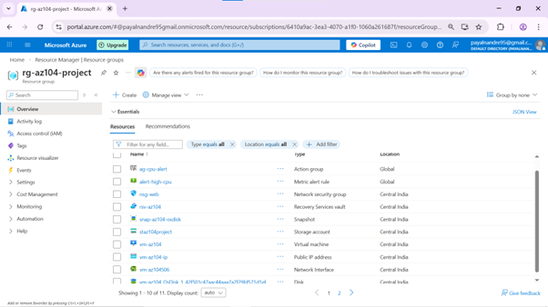
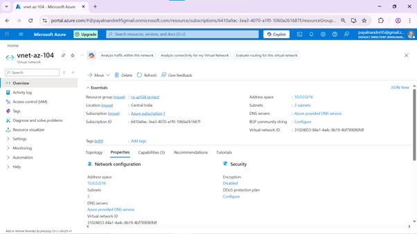
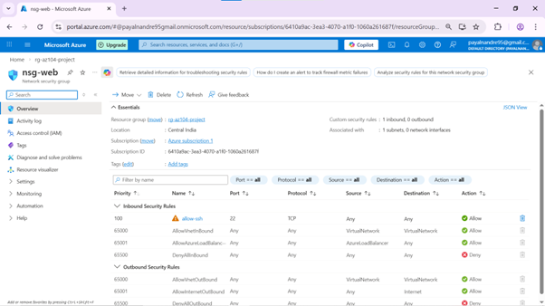
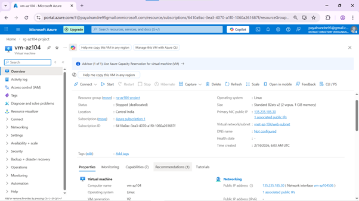
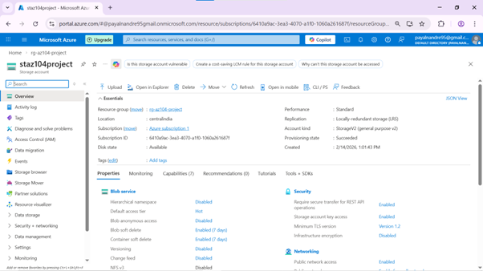
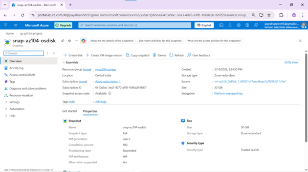
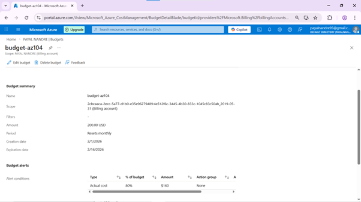
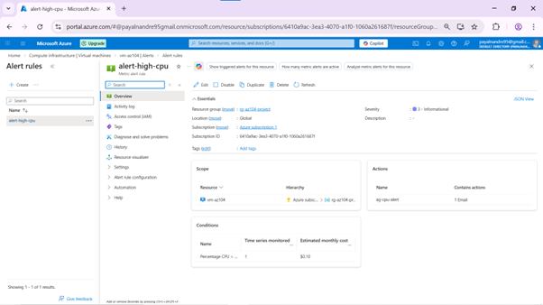

# Azure Infrastructure Administration Lab (AZ-104 Practice)

## Project Overview
Hands-on practice with Azure infrastructure administration, including networking, VM deployment, monitoring, and cost governance.

## Objectives
- Design segmented VNet with web and private subnets
- Configure Network Security Group (NSG) rules for secure SSH access
- Deploy Ubuntu 24.04 LTS VM (B2aTs v2)
- Implement RBAC access control and manual OS disk snapshots
- Configure Azure Monitor alerts and budget alerts for cost optimization

## Technologies Used
- Microsoft Azure: Resource Groups, VNets, NSG, Virtual Machines, Storage Accounts, Snapshots, Monitor, Cost Management
- Cloud concepts: Networking, RBAC, Monitoring, Budget Governance

## Screenshots
1. **Resource Group Overview**  

2. **VNet + Subnets**  

3. **NSG + Inbound Rules**  

4. **VM Overview**  

5. **Storage Account**  

6. **Snapshot Overview**  

7. **Manual OS Disk Backup (snap-az104-osdisk)**  

8. **Budget Alert**  

9. **Azure Monitor Alert**  

